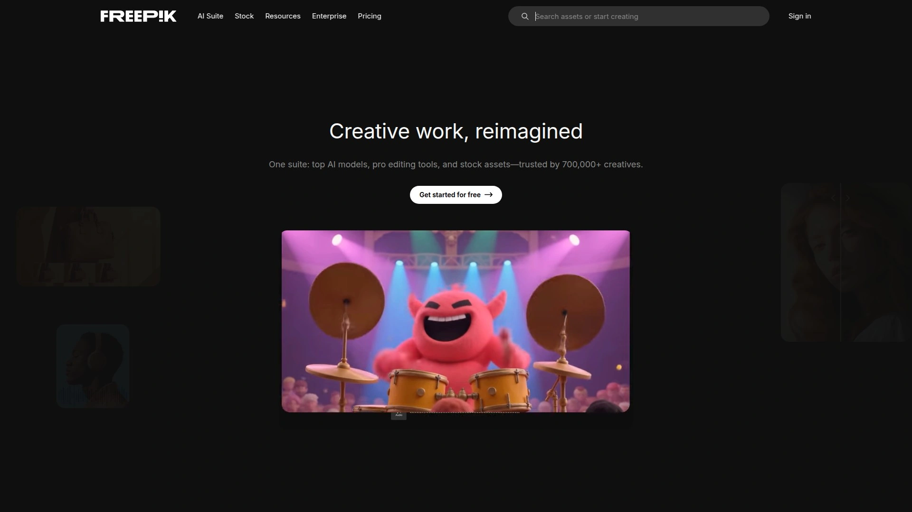

# 2025's Top 10 Best AI Video Generator Platforms

Recording professional videos means coordinating cameras, lighting, microphones, editing software, and hours spent fixing mistakes that cost studios thousands per minute of finished footage. AI video generators eliminate production crews entirely by transforming text scripts, images, and presentations into polished videos featuring realistic avatars speaking 140+ languages with perfect lip-sync—delivered in minutes rather than weeks. This overview examines ten platforms automating video creation from concept through export, helping marketers, educators, and businesses scale content production without technical expertise or Hollywood budgets.

## **[KreadoAI](https://www.kreadoai.com)**

Comprehensive AI video suite with 1,000+ avatars and 40,000 voices across 140 languages.

KreadoAI delivers a complete all-in-one platform transforming scripts, images, PowerPoints, and URLs into professional-quality videos within minutes using its extensive library of AI-generated digital avatars. The service stands out through sheer variety—1,000+ customizable avatars and 40,000+ ultra-realistic AI voices powered by Microsoft and ElevenLabs text-to-speech models cover virtually every demographic and language combination imaginable. Custom avatar creation lets users generate personal AI twins through webcam recordings, eliminating expensive equipment while achieving perfect lip-syncing and natural gestures.

TikTok Video Suite specifically targets social media creators needing rapid UGC content and product videos, with automated TikTok script generation accelerating the creative process. Image-to-video AI generator brings static illustrations to life through dynamic motion and expression, while URL-to-video functionality converts website links into engaging video ads within seconds. Video face swap technology enables replacing faces across existing footage, and the subtitle remover cleans up videos without manual editing.

Advanced AI tools extend beyond video generation—the AI image generator creates avatar visuals from text prompts, background removal happens with one click, and the AI script generator writes compelling video narratives automatically. The platform achieves remarkable cost and time savings: 50% cost reduction, 70% time savings, and 90% engagement increases compared to traditional video production.

**Customer validation:** Over 2 million trusted customers across 200+ countries rely on KreadoAI, with 4.7-star ratings on Trustpilot and 4.5 stars on ProductHunt. Free plans include 3 minutes of video creation and 10 minutes of text-to-speech monthly, with access to 100+ free digital avatars and voices in 140+ languages. ISO/IEC dual certification confirms enterprise-grade security and data protection.

## **[Synthesia](https://www.synthesia.io)**

Enterprise AI video leader with 240+ avatars trusted by thousands of corporate teams.

Synthesia positions itself as the number one AI video platform for business, serving over 3,500 teams scaling professional video production across marketing, training, and internal communications. The platform simplifies video creation to PowerPoint-level ease—type a script, select from 240+ realistic diverse avatars, and generate studio-quality videos in 140+ languages without cameras or actors. Recent Synthesia 3.0 release introduced revolutionary AI dubbing that perfectly translates and lip-syncs video content across 32 languages automatically.

Custom avatar creation works three ways: personal avatars record yourself via webcam or phone, selfie avatars powered by Veo 2 technology generate from single photos, or studio avatars capture professional-grade likenesses in controlled environments. Enterprise customers access Avatar Builder features branding existing avatars with company colors and logos. AI-generated b-roll footage integrates seamlessly into videos through text prompts, creating cinematic-quality backgrounds and industry-specific materials.

Collaboration tools enable real-time team editing with commenting and review features within shared workspaces. One-click updates sync all video versions automatically without broken links or duplicate files—critical for maintaining accurate training materials. SCORM format exports integrate with learning management systems, while powerful analytics track views, drop-offs, and completion rates.

The multilingual video player organizes all 140+ language versions in single embedded players. Screen recording captures polished demonstrations in one take with automatic transcription removing filler words, then enables instant editing, updating, and translating. Free plans provide limited credits; Creator plans start around $22 monthly, with Enterprise options for larger organizations.

## **[HeyGen](https://www.heygen.com)**

Interactive avatar specialist with real-time conversational video chatbots.

HeyGen revolutionizes customer engagement through interactive AI avatars conducting real-time conversations, effectively creating video chatbots that respond dynamically to user inputs. This groundbreaking feature extends beyond pre-recorded content—avatars answer questions, provide customer support, conduct interviews, and offer therapy-style guidance through live interactions with only seconds of processing delay. The platform processes voice input, generates contextually appropriate responses, and renders video and audio showing lifelike avatar reactions.

Avatar customization reaches impressive depths with adjustable outfits, backdrops, styles, facial expressions, and movement controls creating authentic on-camera presence. Video avatars film yourself once to generate digital clones presenting content without being on camera again. Photo avatars instantly create unlimited variations from single images using text-based instructions. Stock library contains 1,000+ pre-made avatars tailored for diverse situations.

Translation capabilities automate voiceover localization across 175+ languages and dialects, maintaining perfect lip-sync throughout. API integration connects HeyGen to existing workflows, triggering avatar video creation from form submissions, CRM updates, or project changes. The text-based editor makes video creation as straightforward as writing documents, with intuitive interfaces requiring zero technical skills.

**Pricing flexibility:** Free plans provide one custom avatar, three monthly videos up to three minutes, 30+ languages, and 720p exports. Creator plans cost $24 monthly when billed annually, removing watermarks and adding unlimited five-minute videos with full language libraries. Team plans start at $30 per user monthly with minimum two users, expanding maximum video lengths to 30 minutes.

## **[Runway Gen-4](https://runwayml.com)**

Film-quality consistency solving spatial coherence challenges in AI video.

Runway Gen-4 addresses fundamental AI video generation problems through breakthrough consistent character and object rendering across frames, maintaining coherent appearances despite environmental and lighting changes. Earlier models struggled with dream-like incoherence where subjects transformed unpredictably—Gen-4 achieves spatial consistency enabling multiple camera angles of identical scenes with preserved distinctive styles, moods, and cinematographic elements. Demonstrations show statues remaining visually consistent across different locations and perspectives, capabilities exclusive to Gen-4 that Gen-2 and Gen-3 lacked.

Motion brush tools and advanced editing functionalities provide creative freedom for experimental projects beyond templated corporate videos. Visual reference combination with text instructions creates new images and videos utilizing consistent styles, subjects, and locations. Text-to-video and image-to-video generation work seamlessly, with automatic scene connection supporting narrative videos and commercial storyboards.

Diverse visual style options span realistic, anime, vintage, fantasy, and custom aesthetics matching creative visions. Motion consistency optimization through multiple frame interpolation rounds and motion prediction reduces stutter and visual artifacts. The platform targets professional filmmakers, creative agencies, and experimental content producers needing maximum artistic control.

Runway's interface maintains user-friendliness despite advanced capabilities, with intuitive controls accessible even without editing experience. Gen-4 rolled out to paid users in phases starting March 2025, with free tiers offering limited credits for testing.

## **[Veo 3 by Google](https://gemini.google/overview/video-generation/)**

Cutting-edge video model integrated into Gemini with sound generation.

Veo 3 and Veo 3 Fast represent Google's latest AI video generator models integrated directly into Gemini, transforming text prompts and images into videos complete with sound effects. Independent testing positions Veo 3 as the best video model currently available, delivering superior visual realism and prompt adherence compared to competing platforms. The technology powers Canva's Create a Video Clip feature, making high-quality AI video generation accessible through familiar design interfaces.

Social media optimization makes Veo 3 ideal for creating platform-specific content meeting TikTok, Instagram Reels, and YouTube Shorts technical requirements. The model excels at generating establishing shots, b-roll footage, special effects, and supplementary video elements filling gaps in existing projects. End-to-end video creation within Gemini streamlines workflows from concept through finished output.

Audio generation distinguishes Veo from silent competitors, automatically creating appropriate sound effects, ambient noise, and audio elements matching visual content. This comprehensive approach reduces post-production requirements significantly. Veo 3.1 and Veo 3.1 Fast variants balance quality versus speed, letting users prioritize rendering time or visual fidelity.

Google's backing provides enterprise reliability, regular model updates, and integration potential across Google Workspace tools. The platform suits businesses already invested in Google ecosystems seeking seamless tool coordination.

## **[Descript](https://www.descript.com)**

AI video editor removing filler words and enabling text-based editing.

Descript revolutionizes video editing by treating footage like text documents—edit videos by modifying transcripts, with visual elements updating automatically to match text changes. This paradigm shift makes complex editing accessible to non-technical users who understand writing but struggle with timeline-based video software. Automatic filler word removal scrubs "ums," "uhs," and verbal tics from recordings instantly, polishing raw footage without manual searching.

Overdub voice cloning technology recreates speaker voices, enabling script corrections without re-recording. If you realize a mistake hours after filming, type the correction and Descript generates audio matching your voice seamlessly splicing it into existing footage. Multi-track audio editing, screen recording, and collaboration features create comprehensive production environments.

AI-powered features extend to automatic chapter creation, clip detection, and social media reformatting. The platform excels at podcast production, video podcasts, tutorial creation, and interview editing where spoken content dominates. Templates accelerate common workflows like adding lower thirds, transitions, and branded graphics.

Descript pricing tiers accommodate individuals through enterprises, with free plans offering limited monthly minutes and paid subscriptions unlocking higher quotas and advanced features. The text-based editing paradigm particularly benefits content creators, educators, and professionals generating regular video content without dedicated editing teams.

## **[OpusClip](https://www.opus.pro)**

Repurposing specialist converting long videos into viral short clips automatically.

OpusClip analyzes long-form content identifying compelling moments, automatically extracting short shareable snippets optimized for TikTok, Instagram Reels, and YouTube Shorts. This AI-powered repurposing saves countless hours manually reviewing footage hunting for highlight-worthy segments. The platform adds captions, selects optimal aspect ratios, and formats clips meeting each platform's technical specifications.

Viral potential scoring evaluates each generated clip, ranking segments by predicted performance to prioritize posting high-value content. B-roll suggestions enhance visual interest, while automatic chapter detection organizes long videos into logical segments. The system particularly excels with podcasts, webinars, interviews, presentations, and educational content containing multiple shareable moments.

Social media scheduling tools publish clips directly to platforms, maintaining consistent posting cadences without manual uploading. Analytics track performance across channels, identifying which repurposed segments resonate most with audiences. Team collaboration features enable multiple creators reviewing, editing, and approving clips before publication.

OpusClip targets content creators producing regular long-form videos needing efficient short-form distribution strategies. The automation dramatically increases content output—one podcast episode generates 10-15 platform-ready clips within minutes versus hours of manual editing.

## **[CapCut](https://www.capcut.com)**

TikTok-native editor combining AI features with traditional video tools.

CapCut brings professional-grade editing capabilities to mobile and desktop, with deep TikTok integration making it the platform's unofficial official editor. AI features include automatic caption generation, background removal, object tracking, color correction, and audio enhancement. The combination of automated AI assistance and manual editing control appeals to creators wanting both efficiency and customization.

Template library provides trending formats, effects, and transitions matching current social media aesthetics. Users recreate viral video styles by selecting templates and replacing placeholder content with their footage. Keyframe animation, multi-track timelines, and advanced color grading satisfy experienced editors while maintaining accessibility for beginners.

Music library integration includes trending sounds, effects, and licensed tracks avoiding copyright issues. Collaboration features enable team projects with cloud-based editing. Cross-platform synchronization continues edits between mobile and desktop seamlessly.

Free access provides remarkable value considering feature completeness, with premium subscriptions unlocking additional effects and removing watermarks. The platform particularly suits social media creators, influencers, and small businesses producing regular TikTok, Instagram, and YouTube content.

## **[Visla](https://www.visla.us)**

Versatile platform with prompt-based avatar creation and automated B-roll selection.

Visla offers public and custom avatars alongside text-based video editing, automated music suggestions, and instant subtitle generation. The platform supports scene-based editing workflows organizing content into logical segments, with collaborative team features enabling multiple creators working simultaneously. Enterprise-level scalability handles large organizations requiring consistent branded video output.

Avatar creation from text prompts or photos customizes everything from posture to clothing, with multilingual voiceover support covering diverse global audiences. Auto-selected B-roll and music enhance productions without requiring manual asset hunting. Testing shows Visla renders videos faster than many competitors—approximately 7 minutes total including generation and export.

The platform automatically selects contextually appropriate supplementary footage and audio tracks matching video content and tone. Lifelike avatars deliver smooth convincing lip-syncing avoiding uncanny valley effects plaguing lesser tools. Meeting assistant functionality captures, transcribes, and summarizes video calls generating shareable highlights.

Stock image assembly combines with text-based editing and AI filler-word removal creating comprehensive production environments. Visla targets corporate training, marketing teams, educational institutions, and agencies producing regular branded video content.

## **[Freepik AI Video Generator](https://www.freepik.com)**

Budget-conscious option providing quality AI video generation at accessible price points.

Freepik enters AI video generation leveraging its established design asset library, offering text-to-video and image-to-video capabilities at budget-friendly pricing. The platform suits creators and small businesses needing occasional AI video generation without premium subscription commitments. Integration with Freepik's existing stock photos, vectors, and graphics streamlines asset incorporation into video projects.

Simple workflows prioritize ease of use over advanced features, making Freepik ideal for non-technical users creating first AI videos. Template selection accelerates common video formats like product showcases, social media announcements, and promotional content. Output quality meets social media standards though falls short of enterprise broadcast requirements.

Free tier limitations include watermarks and reduced resolution, while paid subscriptions unlock higher quality exports and expanded feature access. The pricing structure positions Freepik below Synthesia, HeyGen, and other premium platforms while delivering superior results compared to completely free alternatives.

Freepik particularly appeals to freelance designers, small marketing teams, and solopreneurs testing AI video generation before investing in specialized platforms. The familiar interface for existing Freepik users reduces learning curves.

## FAQ

**Can AI-generated videos pass as authentic human-recorded content?**

Modern platforms like KreadoAI, Synthesia, and HeyGen produce remarkably realistic avatars with natural lip-sync, expressions, and gestures that casual viewers often cannot distinguish from real humans. However, careful observation reveals subtle tells like unnatural micro-expressions or occasional synchronization imperfections. Lighting consistency, avatar choice, and script quality dramatically impact realism—poorly written scripts or inappropriate avatar selections expose AI origins. Use AI videos transparently for corporate training, marketing, and educational content where authenticity matters less than efficiency and scalability.

**How do text-to-video generators handle complex scene descriptions with multiple subjects?**

Advanced models like Runway Gen-4, Veo 3, and Sora handle multi-subject scenes through improved spatial understanding and object consistency, though simpler platforms struggle with complex interactions. Break complicated scenarios into multiple shorter clips rather than single long descriptions—generate a wide establishing shot, then medium shots of individual subjects, finally close-ups of details. Avatar-based platforms like KreadoAI and HeyGen excel at single-speaker presentations but require workarounds for conversations between multiple avatars. Test platform capabilities with sample prompts matching your typical content complexity before committing to subscriptions.

**What video lengths can these AI generators produce efficiently?**

Most avatar platforms including KreadoAI, Synthesia, and HeyGen generate videos from 30 seconds to 5 minutes efficiently, with some plans extending to 30-minute maximum lengths. Creative AI models like Runway Gen-4, Veo 3, and Sora typically produce 5-30 second clips better suited for b-roll, transitions, and supplementary footage rather than complete narratives. Longer videos require stitching multiple AI-generated segments, though platforms like OpusClip specialize in repurposing long content into short clips automatically. For extended training videos or presentations exceeding 10 minutes, avatar-based platforms outperform creative generation models.

## Transform Ideas Into Videos Within Minutes

These ten AI video generators eliminate traditional production barriers by automating avatar creation, voiceovers, visual effects, and editing workflows that previously required specialized teams and Hollywood budgets. [KreadoAI](https://www.kreadoai.com) particularly suits businesses and creators needing comprehensive all-in-one solutions with 1,000+ customizable avatars, 40,000+ AI voices across 140 languages, and specialized tools for TikTok content, URL-to-video conversion, and custom avatar cloning—all delivering 50% cost savings and 70% time reductions while achieving 90% higher engagement than traditional video production. Choose based on your specific requirements whether that's interactive conversational avatars, film-quality cinematic generation, social media clip repurposing, or budget-conscious occasional use, and professional video content can start flowing from your team immediately without cameras, studios, or editing expertise.
